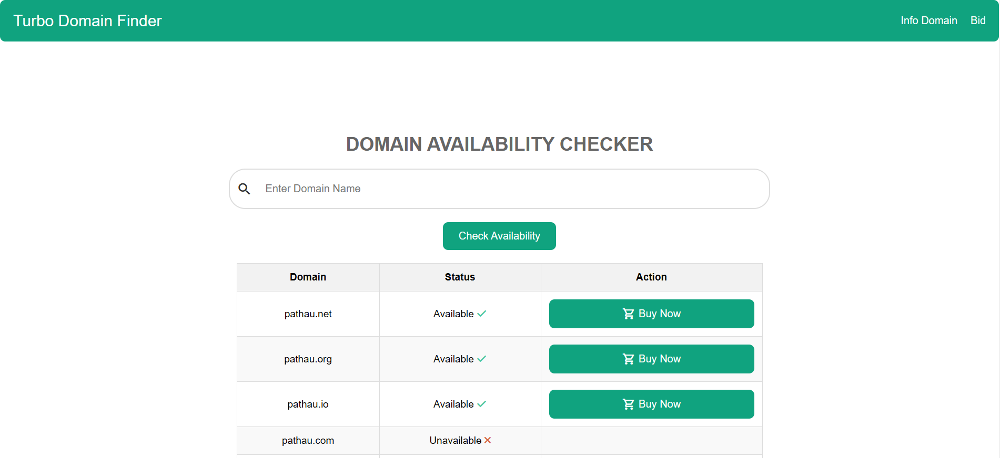

# Turbo-Domain-Finder

Turbo-Domain-Finder is a Flask-based application designed to help you find domain names quickly and efficiently. This repository contains the code and setup instructions for the project.

## Features

- Fast domain name searching
- Easy-to-use web interface
- Built with Flask

## Installation

### 1. Clone the Repository

First, clone the repository to your local machine:

```bash
git clone https://github.com/prasangapokharel/Turbo-Domain-Finder.git
cd Turbo-Domain-Finder
```
### 2. Install Requirements

```bash
pip install -r requirements.txt
```

### 3. Run Flask
```bash
flask run
```
##Contact
Make sure to replace `[prasangaramanpokharel@gmail.com]` with your actual contact email or remove the contact section if you prefer not to include it.
